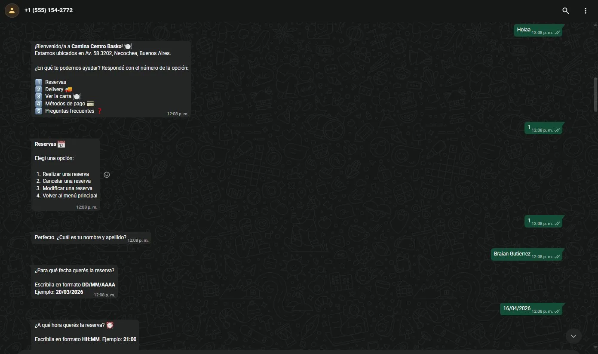
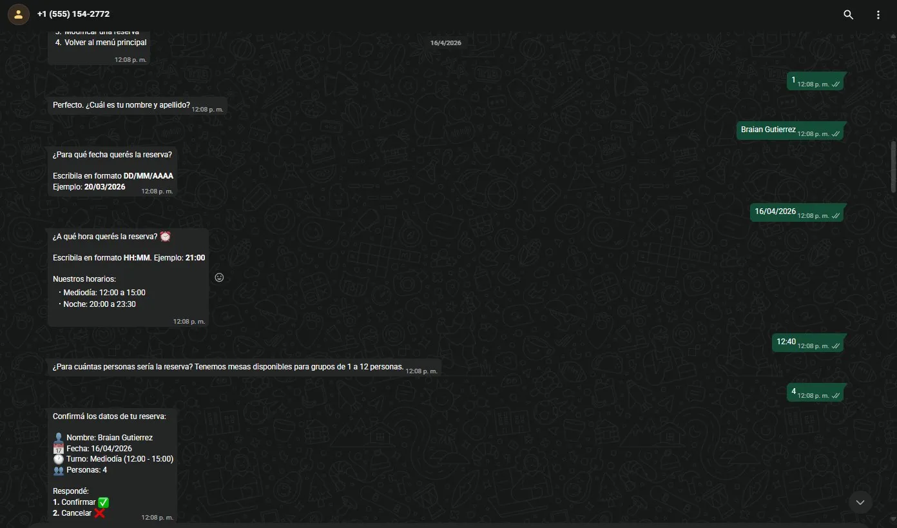
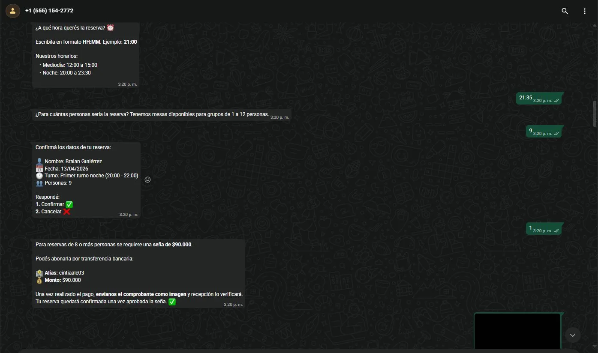
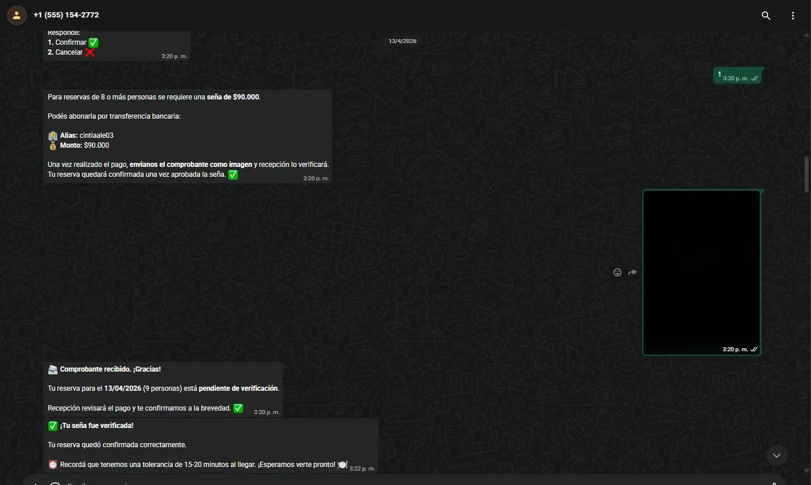
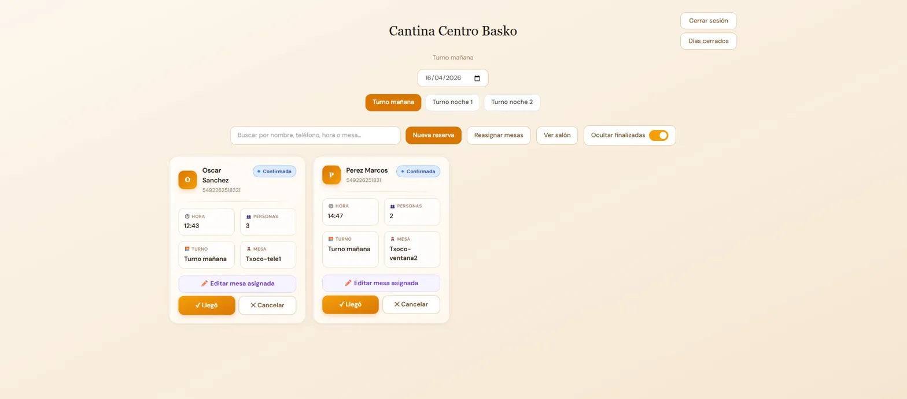
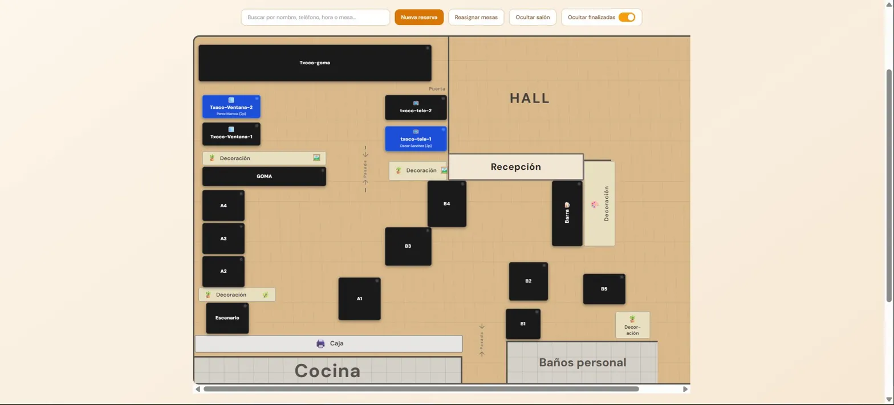
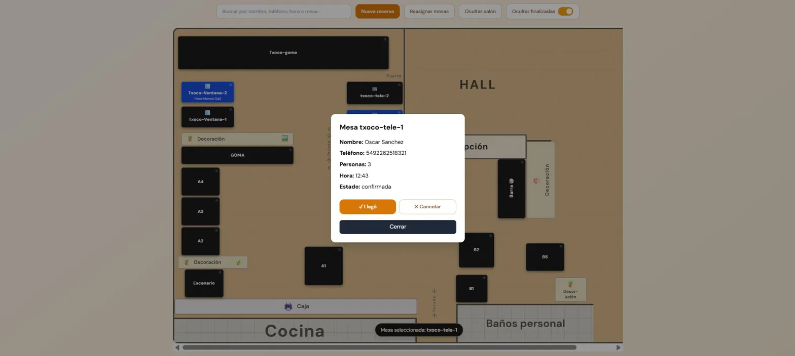
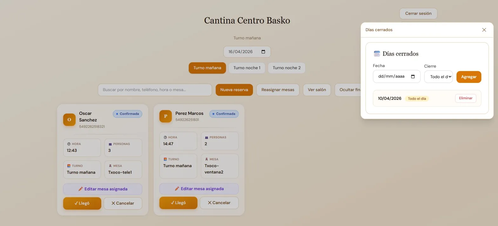

# Cantina Centro Basko – Backend & WhatsApp Bot

Sistema integral de gestión de reservas para un restaurante, desarrollado y desplegado de forma independiente. Automatiza el flujo completo desde la interacción del cliente por WhatsApp hasta la operación interna del salón.

**Demo en vivo:** [cantina-frontend-ten.vercel.app](https://cantina-frontend-ten.vercel.app)

---

## ¿Qué problema resuelve?

El restaurante gestionaba las reservas manualmente por teléfono, lo que generaba errores, sobre-reservas y carga operativa innecesaria en recepción. Este sistema automatiza todo el proceso: el cliente reserva por WhatsApp sin intervención humana, y recepción gestiona el salón desde un panel web en tiempo real.

---

## Arquitectura general

```
Cliente (WhatsApp)
       │
       ▼
  Bot de WhatsApp          ← flujos determinísticos, sin IA
       │
       ▼
  API REST (Express)       ← lógica de negocio, validaciones, reglas
       │
       ▼
  PostgreSQL (Railway)     ← reservas, mesas, sesiones, días cerrados
       │
       ▼
  Panel Web (React/Vercel) ← recepción gestiona en tiempo real
```

---

## Funcionalidades principales

### Bot de WhatsApp
- Reservas con validación de fecha, turno, disponibilidad y capacidad
- Modificación y cancelación de reservas existentes
- Flujo de seña automático para grupos de 8 a 12 personas: el bot solicita transferencia, recibe el comprobante como imagen y recepción lo verifica desde el panel
- Menú informativo: carta, métodos de pago, preguntas frecuentes
- Regla anti-trolling: máximo 2 reservas activas por número por día
- Flujos 100% determinísticos, sin dependencia de LLMs

### Panel web de recepción
- Visualización en tiempo real del estado de todas las reservas por turno y fecha
- Mapa interactivo del salón con estado de cada mesa (libre / ocupada / con reserva)
- Check-in, cancelación y edición de mesa asignada por reserva
- Creación manual de reservas desde recepción
- Gestión de días cerrados por turno o día completo
- Reasignación automática de mesas con un click
- Autenticación segura con cookies `httpOnly`

### Backend / API REST
- Algoritmo de asignación óptima de mesas usando **backtracking con heurísticas MRV (Minimum Remaining Values) y forward checking**: garantiza asignaciones válidas y eficientes incluso en escenarios complejos con múltiples reservas simultáneas
- Lógica de turnos configurable (mediodía / primer turno noche / segundo turno noche)
- Validaciones de negocio: capacidad, solapamiento de turnos, grupos grandes, días cerrados
- Job programado de reasignación de mesas antes de cada servicio

---

## Screenshots

### Bot de WhatsApp – Flujo de reserva



### Bot de WhatsApp – Flujo de seña para grupos




### Panel web – Lista de reservas


### Panel web – Mapa del salón



### Panel web – Días cerrados


---

## Stack tecnológico

| Capa | Tecnología |
|------|-----------|
| Runtime | Node.js |
| Framework | Express |
| Base de datos | PostgreSQL |
| ORM / queries | SQL directo con `pg` |
| Autenticación | Cookies `httpOnly` + `cookie-parser` |
| WhatsApp | WhatsApp Business Cloud API (Meta) |
| Deploy backend | Railway |
| Deploy frontend | Vercel |
| Control de versiones | Git / GitHub |

---

## Estructura del proyecto

```
cantina-backend/
├── src/
│   ├── bot/                  # Lógica del bot de WhatsApp
│   │   ├── handlers/         # Manejadores por flujo (reserva, cancelar, modificar, seña)
│   │   ├── menus/            # Mensajes y opciones de cada menú
│   │   └── sesiones.js       # Gestión de estado de sesión por usuario
│   ├── routes/               # Endpoints de la API REST
│   │   ├── reservas.js       # CRUD de reservas + lógica de negocio
│   │   ├── mesas.js          # Gestión de mesas
│   │   ├── auth.js           # Login / logout
│   │   └── diasCerrados.js   # Gestión de días cerrados
│   ├── services/
│   │   └── asignadorMesas.js # Algoritmo backtracking + MRV + forward checking
│   ├── db/
│   │   └── index.js          # Conexión a PostgreSQL
│   └── index.js              # Entry point, middlewares, webhook de WhatsApp
├── .env.example              # Variables de entorno requeridas (sin valores reales)
├── package.json
└── README.md
```

---

## Variables de entorno

Creá un archivo `.env` en la raíz con las siguientes variables (ver `.env.example`):

```env
# Base de datos
DATABASE_URL=

# WhatsApp Business API
WHATSAPP_TOKEN=
WHATSAPP_PHONE_NUMBER_ID=
WHATSAPP_VERIFY_TOKEN=

# Autenticación
ADMIN_PASSWORD=
COOKIE_SECRET=

# Configuración
PORT=3000
```

---

## Cómo correr el proyecto localmente

```bash
# 1. Clonar el repositorio
git clone https://github.com/tu-usuario/cantina-backend.git
cd cantina-backend

# 2. Instalar dependencias
npm install

# 3. Configurar variables de entorno
cp .env.example .env
# Editá .env con tus credenciales

# 4. Crear las tablas en PostgreSQL
# Ejecutá los scripts SQL de /db/schema.sql contra tu base de datos

# 5. Iniciar el servidor
npm run dev
```

> El bot requiere un webhook público. Para desarrollo local podés usar [ngrok](https://ngrok.com) para exponer el puerto.

---

## Repositorio del frontend

El panel web de recepción está en un repositorio separado:  
[github.com/brautto/cantina-frontend](https://github.com/brautto/cantina-frontend)

---

## Autor

**Braian Rautto** – Ingeniero en Sistemas (UNICEN)  
[LinkedIn](https://www.linkedin.com/in/braian-rautto) · [braianrautto2001@gmail.com](mailto:braianrautto2001@gmail.com)
